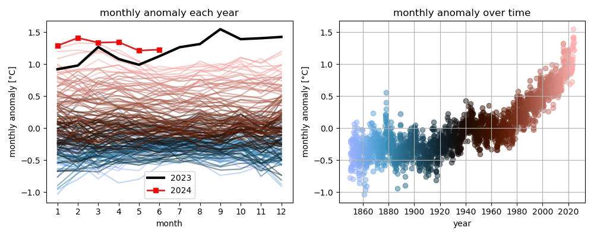
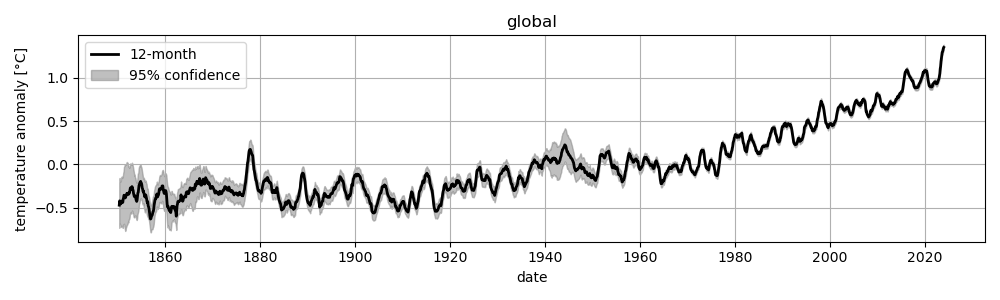

# berkeley-earth
In this repository, I simply plot my own visualization of the temperature anomaly data from [Berkeley Earth](https://berkeleyearth.org/). I download the `*.txt` data files directly from their website.

You can donate to their research effort [here](https://donate.berkeleyearth.org/).

Here are some plots I find especially compelling:
* The global temperature anomaly as a function of the month of the year (left) and linearly in time (right):

* The global temperature anomaly as a function of time, with confidence intervals:
